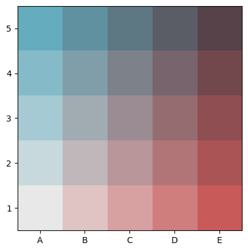
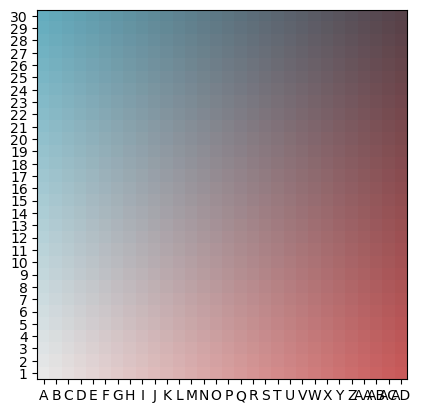

# GridPalette


<!-- WARNING: THIS FILE WAS AUTOGENERATED! DO NOT EDIT! -->

------------------------------------------------------------------------

<a
href="https://github.com/Parkes2/bivariate_choropleth/blob/main/bivariate_choropleth/grid_palette.py#L24"
target="_blank" style="float:right; font-size:smaller">source</a>

### GridPalette

>  GridPalette (color_list)

*Initialize self. See help(type(self)) for accurate signature.*

------------------------------------------------------------------------

<a
href="https://github.com/Parkes2/bivariate_choropleth/blob/main/bivariate_choropleth/grid_palette.py#L55"
target="_blank" style="float:right; font-size:smaller">source</a>

### BivariateGridPalette

>  BivariateGridPalette (palette_name:str='blues2reds', grid_size:int=3,
>                            upper_left_color:Union[str,tuple,NoneType]=None,
>                            lower_right_color:Union[str,tuple,NoneType]=None,
>                            upper_right_color:Union[str,tuple,NoneType]=None)

*Class for the Palette. Creates a grid_size x grid_size matrix of colors
from the inputed corner colors*

the representation of the grid palette is the imshow of the color matrix

``` python
gp = BivariateGridPalette(grid_size=5)
gp
```

    BivariateGridPalette blues2reds



you can resize grid palettes with `gp.resize(new_size)`

``` python
gp.resize(30)
assert len(gp.color_list) == 900
gp
```

    BivariateGridPalette blues2reds



## Generating Palettes

------------------------------------------------------------------------

<a
href="https://github.com/Parkes2/bivariate_choropleth/blob/main/bivariate_choropleth/grid_palette.py#L164"
target="_blank" style="float:right; font-size:smaller">source</a>

### from_list

>  from_list (upper_left_color, lower_right_color=None,
>                 upper_right_color=None, palette_name='from_list', grid_size=3)

*Generate a BivariateGridPalette from inputted corner colors*

``` python
gp = BivariateGridPalette.from_list('#9972af','#c8b35a','#804d36')

assert len(gp.color_list) == 9
gp = BivariateGridPalette.from_list(['#9972af','#c8b35a','#804d36'], grid_size=4)
assert len(gp.color_list) == 16
```

------------------------------------------------------------------------

<a
href="https://github.com/Parkes2/bivariate_choropleth/blob/main/bivariate_choropleth/grid_palette.py#L183"
target="_blank" style="float:right; font-size:smaller">source</a>

### from_dropdown

>  from_dropdown ()

*Select BivariateGridPalette from dropdown list*

------------------------------------------------------------------------

<a
href="https://github.com/Parkes2/bivariate_choropleth/blob/main/bivariate_choropleth/grid_palette.py#L229"
target="_blank" style="float:right; font-size:smaller">source</a>

### from_picker

>  from_picker (mode='darken')

*BivariateGridPalette from a single color picker*

``` python
gp = from_picker()
```

    interactive(children=(ColorPicker(value='#64acbe', description='upper_left_color'), IntSlider(value=3, descrip…

------------------------------------------------------------------------

<a
href="https://github.com/Parkes2/bivariate_choropleth/blob/main/bivariate_choropleth/grid_palette.py#L255"
target="_blank" style="float:right; font-size:smaller">source</a>

### from_pickers_3

>  from_pickers_3 ()

*BivariateGridPalette from three color pickers*

``` python
gp = from_pickers_3()
```

    interactive(children=(ColorPicker(value='#64acbe', description='upper_left_color'), ColorPicker(value='#c85a5a…
