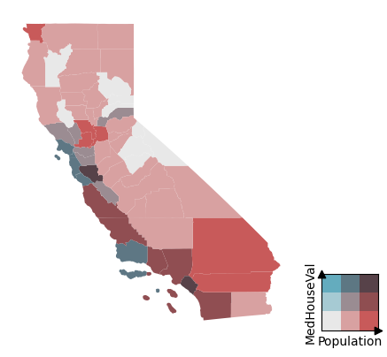

# Plotting


<!-- WARNING: THIS FILE WAS AUTOGENERATED! DO NOT EDIT! -->

------------------------------------------------------------------------

<a
href="https://github.com/Parkes2/bivariate_choropleth/blob/main/bivariate_choropleth/plotting.py#L16"
target="_blank" style="float:right; font-size:smaller">source</a>

### BivariateChoropleth

>  BivariateChoropleth (gdf:geopandas.geodataframe.GeoDataFrame, x:str,
>                           y:str, grid_size:int=3, gp=None,
>                           palette_name='blues2reds')

*Class for Bivariate Choropleth*

<table>
<thead>
<tr>
<th></th>
<th><strong>Type</strong></th>
<th><strong>Default</strong></th>
<th><strong>Details</strong></th>
</tr>
</thead>
<tbody>
<tr>
<td>gdf</td>
<td>GeoDataFrame</td>
<td></td>
<td></td>
</tr>
<tr>
<td>x</td>
<td>str</td>
<td></td>
<td>column name for the x part of the bivariate axis</td>
</tr>
<tr>
<td>y</td>
<td>str</td>
<td></td>
<td>column name for the y part of the bivariate axis</td>
</tr>
<tr>
<td>grid_size</td>
<td>int</td>
<td>3</td>
<td>grid size, used in pd.cut and GridPalette</td>
</tr>
<tr>
<td>gp</td>
<td>NoneType</td>
<td>None</td>
<td></td>
</tr>
<tr>
<td>palette_name</td>
<td>str</td>
<td>blues2reds</td>
<td></td>
</tr>
</tbody>
</table>

------------------------------------------------------------------------

<a
href="https://github.com/Parkes2/bivariate_choropleth/blob/main/bivariate_choropleth/plotting.py#L85"
target="_blank" style="float:right; font-size:smaller">source</a>

### plot_bivariate_choropleth

>  plot_bivariate_choropleth (data:geopandas.geodataframe.GeoDataFrame,
>                                 x:str, y:str, grid_size:int=None, grid_palette
>                                 :bivariate_choropleth.grid_palette.GridPalette
>                                 =None, palette_name:str='blues2reds',
>                                 return_frame:bool=False)

*Plotting function for bivariate choropleth.*

<table>
<thead>
<tr>
<th></th>
<th><strong>Type</strong></th>
<th><strong>Default</strong></th>
<th><strong>Details</strong></th>
</tr>
</thead>
<tbody>
<tr>
<td>data</td>
<td>GeoDataFrame</td>
<td></td>
<td></td>
</tr>
<tr>
<td>x</td>
<td>str</td>
<td></td>
<td></td>
</tr>
<tr>
<td>y</td>
<td>str</td>
<td></td>
<td></td>
</tr>
<tr>
<td>grid_size</td>
<td>int</td>
<td>None</td>
<td>Overrides grid_palette size if given</td>
</tr>
<tr>
<td>grid_palette</td>
<td>GridPalette</td>
<td>None</td>
<td>Defaults to palette_name</td>
</tr>
<tr>
<td>palette_name</td>
<td>str</td>
<td>blues2reds</td>
<td>Only used if grid_palette is None</td>
</tr>
<tr>
<td>return_frame</td>
<td>bool</td>
<td>False</td>
<td></td>
</tr>
<tr>
<td><strong>Returns</strong></td>
<td><strong>Axes</strong></td>
<td></td>
<td></td>
</tr>
</tbody>
</table>

``` python
gp = BivariateGridPalette.from_dropdown()
```

    interactive(children=(Dropdown(description='name', options=('blues2reds', 'purple2gold', 'purple2cyan', 'green…

## An example

``` python
from bivariate_choropleth.shapefiles import load_gdf
```

load the geodataframe from default path

``` python
ca = load_gdf('ca_counties')
ca = ca.to_crs(epsg=4326)

ca.head()
```

<div>
<style scoped>
    .dataframe tbody tr th:only-of-type {
        vertical-align: middle;
    }
&#10;    .dataframe tbody tr th {
        vertical-align: top;
    }
&#10;    .dataframe thead th {
        text-align: right;
    }
</style>

<table class="dataframe" data-quarto-postprocess="true" data-border="1">
<thead>
<tr style="text-align: right;">
<th data-quarto-table-cell-role="th"></th>
<th data-quarto-table-cell-role="th">STATEFP</th>
<th data-quarto-table-cell-role="th">COUNTYFP</th>
<th data-quarto-table-cell-role="th">COUNTYNS</th>
<th data-quarto-table-cell-role="th">GEOID</th>
<th data-quarto-table-cell-role="th">NAME</th>
<th data-quarto-table-cell-role="th">NAMELSAD</th>
<th data-quarto-table-cell-role="th">LSAD</th>
<th data-quarto-table-cell-role="th">CLASSFP</th>
<th data-quarto-table-cell-role="th">MTFCC</th>
<th data-quarto-table-cell-role="th">CSAFP</th>
<th data-quarto-table-cell-role="th">CBSAFP</th>
<th data-quarto-table-cell-role="th">METDIVFP</th>
<th data-quarto-table-cell-role="th">FUNCSTAT</th>
<th data-quarto-table-cell-role="th">ALAND</th>
<th data-quarto-table-cell-role="th">AWATER</th>
<th data-quarto-table-cell-role="th">INTPTLAT</th>
<th data-quarto-table-cell-role="th">INTPTLON</th>
<th data-quarto-table-cell-role="th">Shape_Leng</th>
<th data-quarto-table-cell-role="th">Shape_Area</th>
<th data-quarto-table-cell-role="th">geometry</th>
</tr>
</thead>
<tbody>
<tr>
<td data-quarto-table-cell-role="th">0</td>
<td>06</td>
<td>091</td>
<td>00277310</td>
<td>06091</td>
<td>Sierra</td>
<td>Sierra County</td>
<td>06</td>
<td>H1</td>
<td>G4020</td>
<td>None</td>
<td>None</td>
<td>None</td>
<td>A</td>
<td>2.468695e+09</td>
<td>2.329911e+07</td>
<td>+39.5769252</td>
<td>-120.5219926</td>
<td>375602.758281</td>
<td>4.200450e+09</td>
<td>POLYGON ((-120.6556 39.69357, -120.65554 39.69...</td>
</tr>
<tr>
<td data-quarto-table-cell-role="th">1</td>
<td>06</td>
<td>067</td>
<td>00277298</td>
<td>06067</td>
<td>Sacramento</td>
<td>Sacramento County</td>
<td>06</td>
<td>H1</td>
<td>G4020</td>
<td>472</td>
<td>40900</td>
<td>None</td>
<td>A</td>
<td>2.499984e+09</td>
<td>7.542543e+07</td>
<td>+38.4500161</td>
<td>-121.3404408</td>
<td>406584.174167</td>
<td>4.205516e+09</td>
<td>POLYGON ((-121.18858 38.71431, -121.18732 38.7...</td>
</tr>
<tr>
<td data-quarto-table-cell-role="th">2</td>
<td>06</td>
<td>083</td>
<td>00277306</td>
<td>06083</td>
<td>Santa Barbara</td>
<td>Santa Barbara County</td>
<td>06</td>
<td>H1</td>
<td>G4020</td>
<td>None</td>
<td>42200</td>
<td>None</td>
<td>A</td>
<td>7.084063e+09</td>
<td>2.729752e+09</td>
<td>+34.5370572</td>
<td>-120.0399729</td>
<td>891686.747247</td>
<td>1.449841e+10</td>
<td>MULTIPOLYGON (((-120.7343 34.90069, -120.73431...</td>
</tr>
<tr>
<td data-quarto-table-cell-role="th">3</td>
<td>06</td>
<td>009</td>
<td>01675885</td>
<td>06009</td>
<td>Calaveras</td>
<td>Calaveras County</td>
<td>06</td>
<td>H1</td>
<td>G4020</td>
<td>None</td>
<td>None</td>
<td>None</td>
<td>A</td>
<td>2.641785e+09</td>
<td>4.384187e+07</td>
<td>+38.1838996</td>
<td>-120.5614415</td>
<td>367005.879680</td>
<td>4.356213e+09</td>
<td>POLYGON ((-120.63095 38.34111, -120.63058 38.3...</td>
</tr>
<tr>
<td data-quarto-table-cell-role="th">4</td>
<td>06</td>
<td>111</td>
<td>00277320</td>
<td>06111</td>
<td>Ventura</td>
<td>Ventura County</td>
<td>06</td>
<td>H1</td>
<td>G4020</td>
<td>348</td>
<td>37100</td>
<td>None</td>
<td>A</td>
<td>4.771988e+09</td>
<td>9.473454e+08</td>
<td>+34.3587415</td>
<td>-119.1331432</td>
<td>527772.242190</td>
<td>8.413293e+09</td>
<td>MULTIPOLYGON (((-119.32923 34.22784, -119.3292...</td>
</tr>
</tbody>
</table>

</div>

``` python
from sklearn.datasets import fetch_california_housing
import shapely
from shapely import Point
```

process the dataset. Get house prices from the Sklearn dataset. Create a
geometry column (Point) with shapely. Perform a spatial join

``` python
housing = fetch_california_housing(as_frame=True)
housing_data = housing.data.join(housing.target)
housing_data['geometry'] = housing_data.apply(lambda x: Point(x.Longitude, x.Latitude), axis=1)

housing_data = gpd.GeoDataFrame(housing_data, geometry='geometry', crs="EPSG:4326") 

housing_data = gpd.sjoin(housing_data, ca, how='left', predicate='within')
```

get the average per county (index to join on to the spatial data)

``` python
county_level_data = housing_data.groupby('COUNTYNS')[['Population', 'MedHouseVal']].mean()

ca_geo = ca.set_index('COUNTYNS')[['geometry']]
county_level_data = ca_geo.join(county_level_data)
```

``` python
ax, cax = plot_bivariate_choropleth(county_level_data, y='MedHouseVal', x='Population', grid_palette=gp)
```


