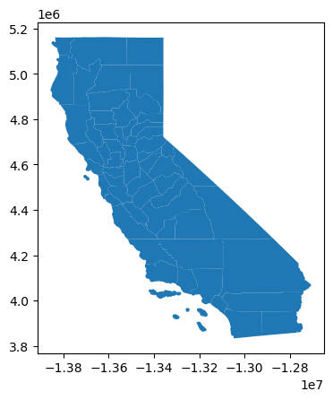

# Shapefiles


<!-- WARNING: THIS FILE WAS AUTOGENERATED! DO NOT EDIT! -->

point to a default location (Users/Documents/GEOG_FILES) if its empty,
create it and download a simple geography file e.g. california

Do we want to create a registry?

------------------------------------------------------------------------

<a
href="https://github.com/Parkes2/bivariate_choropleth/blob/main/bivariate_choropleth/shapefiles.py#L35"
target="_blank" style="float:right; font-size:smaller">source</a>

### download_and_unzip

>  download_and_unzip (url, filename,
>                          download_path=Path('/home/runner/Documents/SHP_FILES'
>                          ))

------------------------------------------------------------------------

<a
href="https://github.com/Parkes2/bivariate_choropleth/blob/main/bivariate_choropleth/shapefiles.py#L18"
target="_blank" style="float:right; font-size:smaller">source</a>

### check_shapefiles_path

>  check_shapefiles_path (shp_path=Path('/home/runner/Documents/SHP_FILES'))

*Looks for a Path User/Documents/SHP_FILES. Does it contain Shapefiles*

------------------------------------------------------------------------

<a
href="https://github.com/Parkes2/bivariate_choropleth/blob/main/bivariate_choropleth/shapefiles.py#L61"
target="_blank" style="float:right; font-size:smaller">source</a>

### load_gdf

>  load_gdf (foldername=None, plot=False,
>                shp_path=Path('/home/runner/Documents/SHP_FILES'))

*Load shapefiles into gdf*

<table>
<colgroup>
<col style="width: 6%" />
<col style="width: 25%" />
<col style="width: 34%" />
<col style="width: 34%" />
</colgroup>
<thead>
<tr>
<th></th>
<th><strong>Type</strong></th>
<th><strong>Default</strong></th>
<th><strong>Details</strong></th>
</tr>
</thead>
<tbody>
<tr>
<td>foldername</td>
<td>NoneType</td>
<td>None</td>
<td>If no argument is entered, function will print out the list of shp
files in the shape files directory</td>
</tr>
<tr>
<td>plot</td>
<td>bool</td>
<td>False</td>
<td></td>
</tr>
<tr>
<td>shp_path</td>
<td>PosixPath</td>
<td>/home/runner/Documents/SHP_FILES</td>
<td></td>
</tr>
</tbody>
</table>

``` python
ca = load_gdf('ca_counties', plot=True)
```



``` python
load_gdf()
```

    Available shapefiles are:  atlanta_hom atlanta_hom LSOA_2021_BOUNDARIES_V4 ca_state ca_counties ca_places
